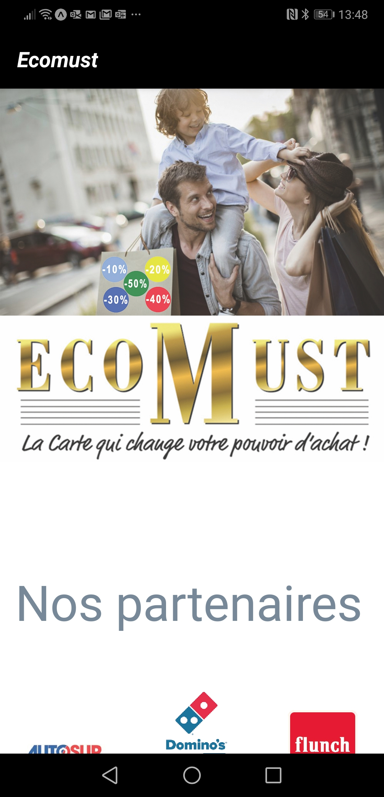
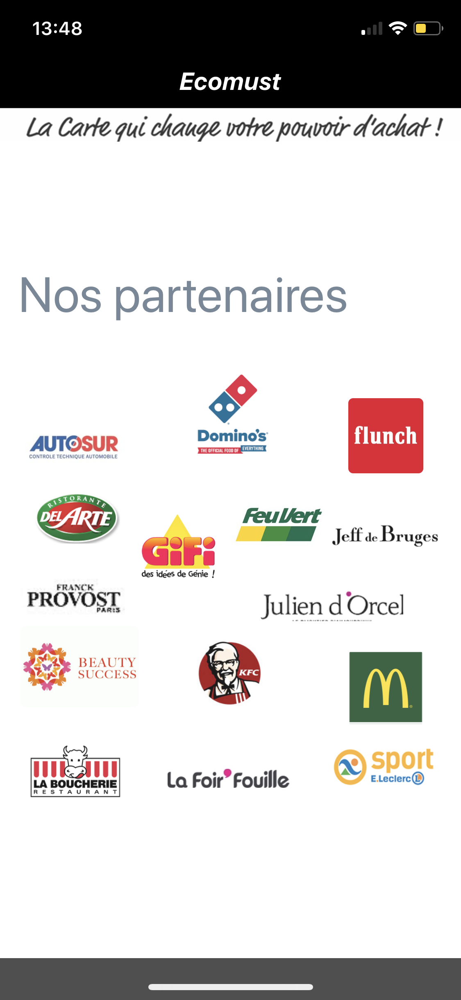
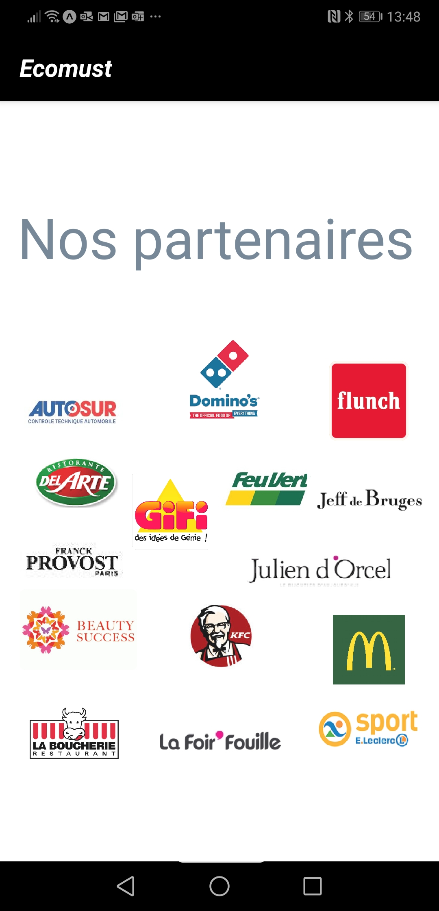
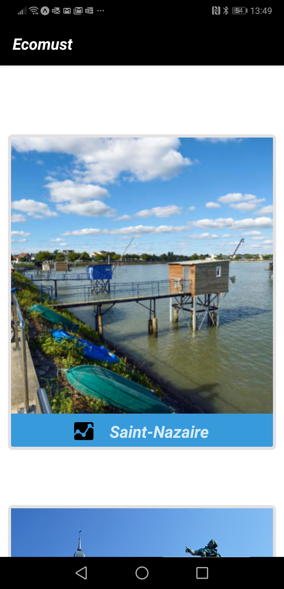
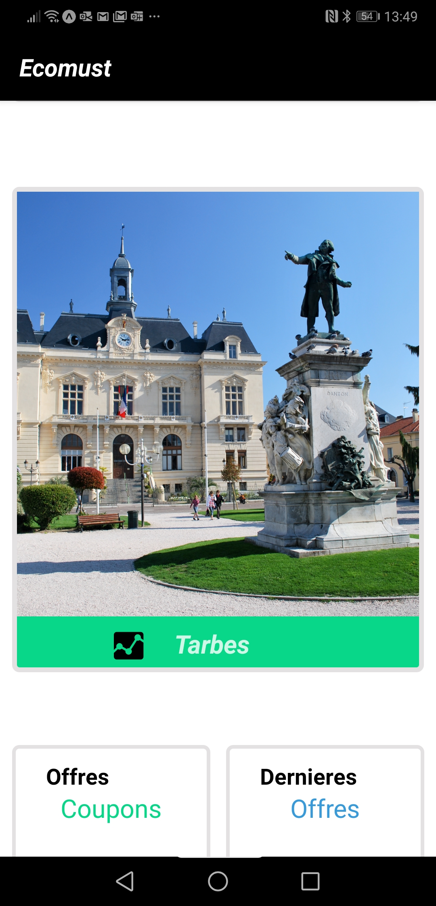
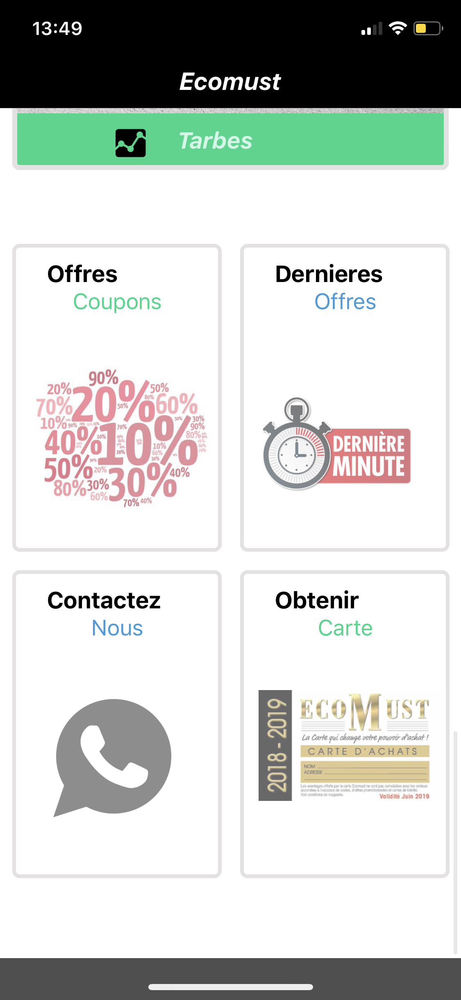
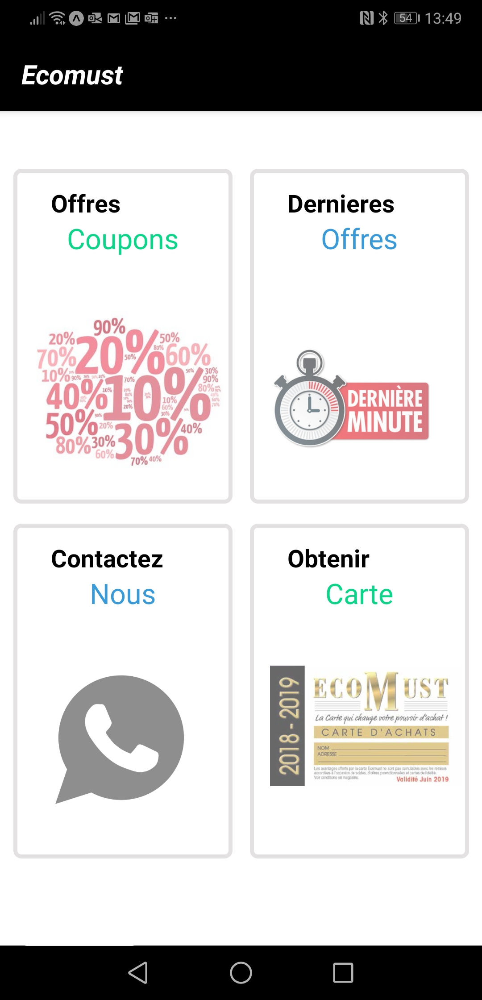

# Application Ecomust

Ecomust offers of discounts for employees at the largest brands.

**Name** : Ecomust  
**Company** : Edition Le Goéland  
**Framework** : React Native  
**Location** : France  
**Author** : Hugo Diaz  

## Screenshots

-------------------

  1. *Main Menu*
      >**A.**
      * **IOS**
     >
      * **Android**
     >
      
      >**B.**
      * **IOS**
     >
      * **Android**
     >
     
      >**C.**
      * **IOS**
     >
      * **Android**
     >
     
      >**D.**
      * **IOS**
     >
      * **Android**
     >
      
       >**E.**
      * **IOS**
     >
      * **Android**
     >
     

  2. *Partner of Saint Nazaire* 
      * **IOS**
     >
      * **Android**
     >

  3. *Partner of Tarbes*
      * **IOS**
     >
      * **Android**
     >

  3. *If you want to contact us*
      * **IOS**
     >
      * **Android**
     >

#### Thank's. The project is under development :smile:
